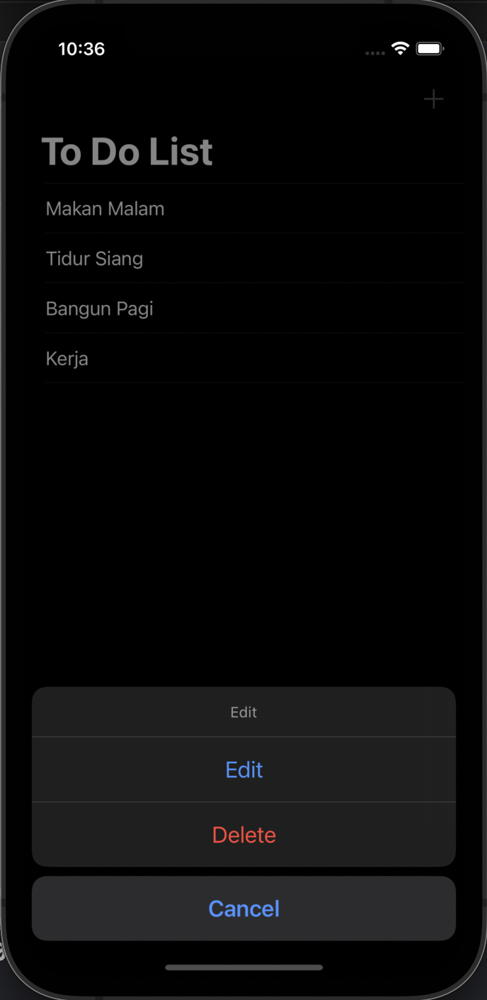
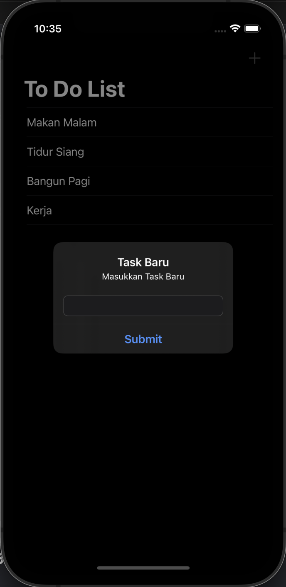
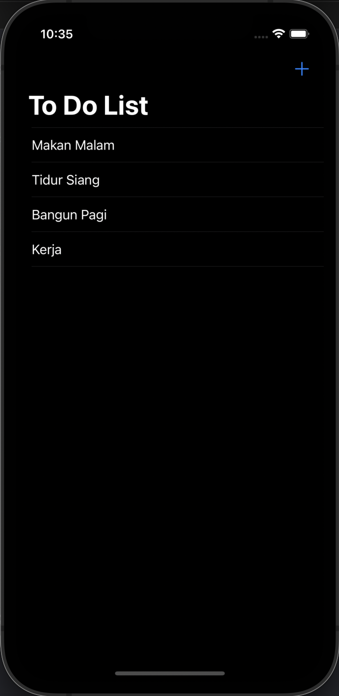

# ToDoList
<!-- ABOUT THE PROJECT -->
<p align="center">
  <a href="#" target="_blank"></a>
</p>

Aplikasi iOS ToDoList adalah sebuah aplikasi CRUD sederhana berbasis iOS yang digunakan untuk membuat sebuah list item. Aplikasi ini dibuat menggunakan TableView (Row), ActionSheet, Alert, dan Core Data (sebagai local database). Pengguna dapat membuat list item, membaca list item yang telah dibuat, mengubah list item yang telah dibuat, dan menghapus item yang telah dibuat.

## Preview
<p align="center">
    <a href="#" target="_blank"></a>
    <a href="#" target="_blank"></a>
    <a href="#" target="_blank"></a>
</p>

<!-- ABOUT THE FILE & FOLDER STRUCTURE -->
## Folder & File Structure
Berikut struktur file dan folder pada ToDoList:

    .
    ├── AppDelegate.swift
    ├── SceneDelegate.swift
    ├── ViewController.swift                          # Tampilan Beranda Aplikasi
    ├── info
    ├── ToDoList.xcdatamodeld                         # Core Data (Xcode Local Database)
    └── ToDoListItem                                  # ToDoListItem
        ├── ToDoListItem+CoreDataClass.swift          # Berisikan Protocol NSManagedObject
        └── ToDoListItem+CoreDataProperties.swift     # Berisikan Extension Fetch Attribute dari Core Data

<!-- List of Features -->
## Features:

* CRUD -> Task
* Local Save

### Build With:

* [Swift](https://www.swift.org/documentation/)
* [Xcode](https://developer.apple.com/xcode/)
* [Core Data (Local Database)](https://developer.apple.com/documentation/coredata)

<!-- How to Install -->
## Installation
Untuk menggunakan repositori ini, ikutilah petunjuk penggunaan berikut dan pastikan git sudah terinstall pada komputer (semua perintah dilaksanakan pada `cmd.exe` atau `terminal`):

1. Lakukan download .zip atau `clone` repositori dengan cara:
```bash
git clone https://github.com/dekapd99/ToDoList.git
```

2. Jika sudah silahkan buka Project di Xcode
3. Build & Run

<!-- What Kind of License? -->
## License
No License 

<p align="right">(<a href="#top">back to top</a>)</p>
